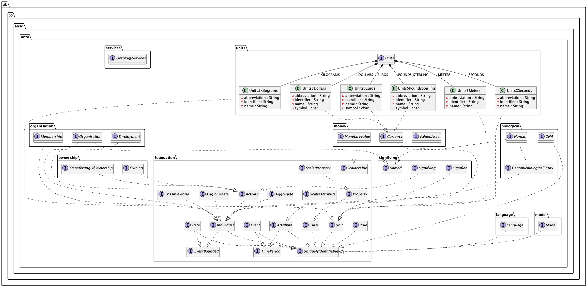

# Foundation Ontology

This library is a work-in-progress to define a Top Level Ontology in Java that is compatible with [HQDM](https://github.com/hqdmTop/hqdmFramework) and easier for developers to use than [MagmaCore](https://github.com/gchq/MagmaCore). Only time will tell if this will be successful.

See [this blog post](https://twalmsley.github.io/blog1/blog1.html) for a discussion of HQDM and [this blog post](https://twalmsley.github.io/blog1/blog2.html) for the background to this library.

